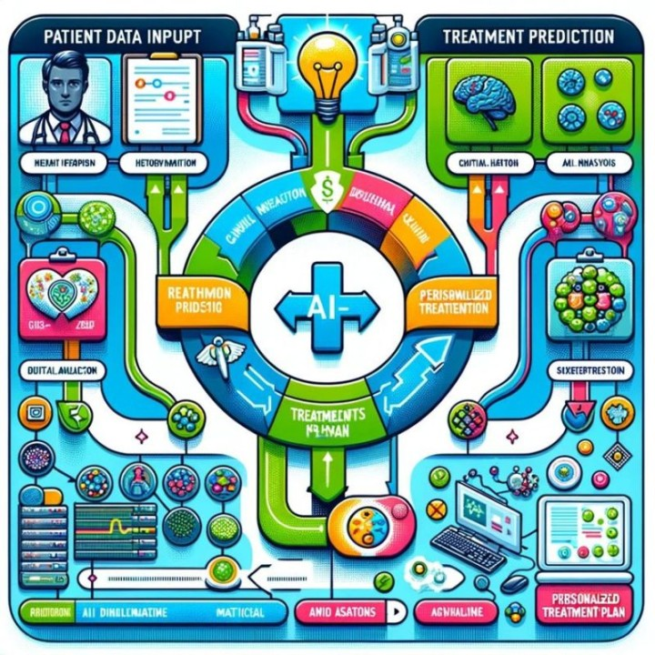

<h2 align="center">🚀 Day 4/366: AI in Personalized Treatment Plans 🩺</h2>

AI is transforming personalized medicine, moving away from a one-size-fits-all approach to tailored treatments.

  

<ul>
  <li><strong>Data Analysis:</strong> AI analyzes patient data, including genetics and medical history, to uncover unique patterns.</li>
  <li><strong>Predictive Modeling:</strong> Advanced algorithms predict disease progression, helping forecast patient responses to treatments.</li>
  <li><strong>Customized Recommendations:</strong> AI suggests personalized plans, considering specific drug combinations and dosages.</li>
  <li><strong>Learning & Adaptation:</strong> AI continuously evolves, learning from new patient data for better treatment predictions.</li>
  <li><strong>Tech Integration:</strong> AI works with genomics and biotech for comprehensive health views.</li>
  <li><strong>Remote Monitoring:</strong> AI aids in real-time treatment adjustments using wearable tech.</li>
</ul>

<h3 align="center">Case Study: IBM Watson & Mayo Clinic</h3>

<strong>Objective:</strong> To personalize cancer treatments by analyzing medical data and research.

<ul>
  <li><strong>Data Analysis:</strong> Watson processes medical literature, patient records, and clinical trials.</li>
  <li><strong>Treatment Options:</strong> Identifies effective treatments based on each patient's cancer type and genetics.</li>
  <li><strong>Clinical Trials:</strong> Suggests suitable trials for patients.</li>
  <li><strong>Impact:</strong> Enhances decision-making, personalizes care, and increases research efficiency.</li>
</ul>

This collaboration showcases AI's potential in personalized medicine, enhancing treatment precision and supporting healthcare professionals.

Mayo Clinic: <a href="https://lnkd.in/grgxrVEd">https://lnkd.in/grgxrVEd</a>

  <em>Leave your ideas for better discussion!</em>

  <em>#AI #ML #personalizedmed #spreadingaithroughsl</em>

